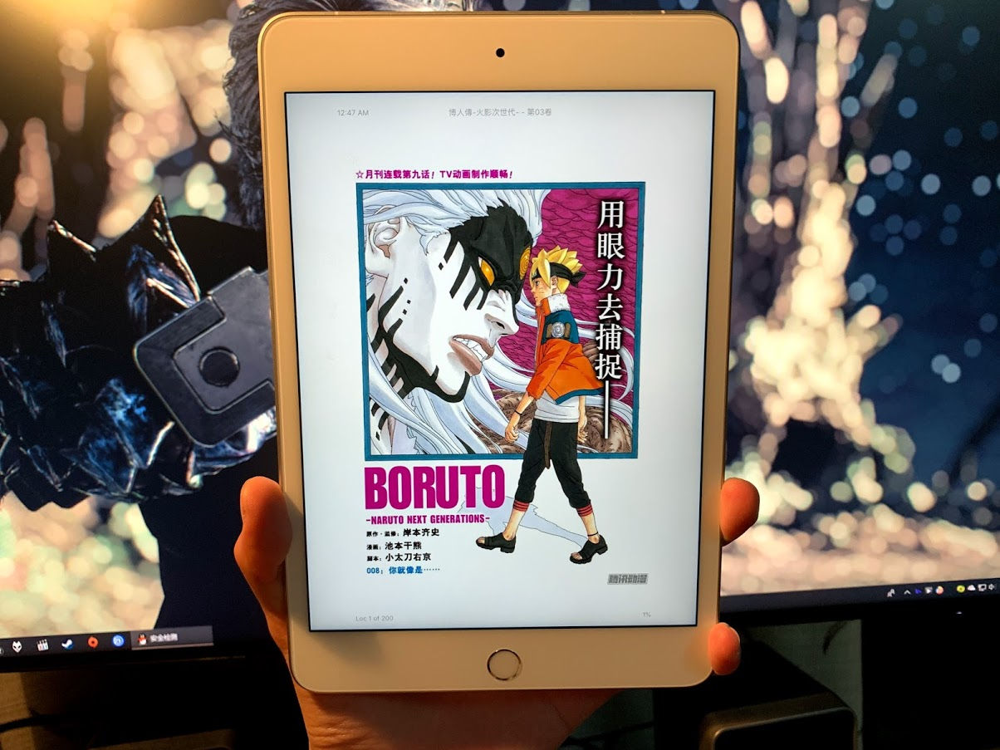

# iPad Mini5 体验：小身材蕴藏大能量

# 购买

去年年底入手了iPad Pro，A12x + 11寸120Hz全面屏荧幕使用体验极佳，但碍于11寸的体积，并不是由非常大的携带外出的冲动。正巧，Apple前段时间更新了iPad mini的产品线，借着去香港的契机，帮朋友入手了一台iPad mini 5 Cellular版本，顺便体验一下mini 5是否真的这么香。

PS.因为朋友已有iPad Pro，所以Mini就没有配笔了~

我选择了在Apple官网订购，Apple Store提货的方式。订购时黑色已经售罄需要等补货了了，退而求其次选择了可以当日提货的银色款。

到店提货：香港沙田Apple New Town Plaza

现场人好多啊xD（一整天走到哪都是人人人人人）

找了一个店员，出示邮件里面的提货二维码就可以了~

过了一会就拿到Mini5啦~

特色苹果纸袋~

干货：当时向店员咨询了一下线上订购，Apple Store自提的一些规定：

- 订单会被保留多久？15天，过了15天之后没有提货默认进行退货处理，**扣除15%的手续费**。

- 提货出示的证件？有名字的证件就可以，亲测港澳通行证可以使用。

- 下订单时的联系人号码怎么写？可以直接写内地的11位电话号码。但请确保邮箱一定能收到确认邮件，不然就没有办法提货。

  

# 开箱

  

  

  打开之后，iPad mini静静的躺在里面

  

  撕膜~

  

  开机~

  

  在选择完语言后，手上的iPhone弹出是否要设置新iPad mini，一直觉得苹果能发现附近新设备的功能非常得神器，我们选择继续~然后一路Continue就把iPad mini设置好了~

  接下来看看其他配件~

  

  iPad mini下面是Lightning数据线一条，苹果纸片一盒

  

  苹果纸片若干

  

  拿走我们的苹果纸片，下面是英标充电头。

  这就是iPad mini的全部开箱了~

  没有耳机，内容物和其他iPad一模一样，嗯对。

  啊，还有环境保护署赠送的精美贴纸一张~

  

# 硬件部分

## 机身细节

经历过香港人潮的洗礼，拖着疲惫的身躯回到家，继续拍图。

SIM卡托

插上后成功认到电信4G信号~

底部有Lightning接口

顶部保留3.5mm耳机口，镜头没有突出

后面有4G版的天线条，中间有mini5新增的麦克风一个

## 三围对比

接下来拉出iPad Pro对比一下：

可以很清楚的看到，即便mini 5没有采用全面屏设计，正面也比iPad Pro小了一整圈，便携性提升了不少。同时mini 5的摄像头也没有突出，不带套时可以完全平放在桌面上~

接口方面，mini5 继续沿用Lightning，而且没有键盘的三个连接触点。

厚度两者相差无几。

## 看了完全没用但既然跑了就发一下的Geekbench跑分

从上到下分别为iPad mini、iPhone XR、iPad Pro 11寸

## 非专业显示屏对比

显示屏部分由于我没有专业的设备，只能用手机拍一下对比图了~肉眼上看差距并不大，只供参考。

自动亮度、打开True Tone。

## 非专业4G网络测速对比

这里使用被吐槽信号烂的iPhone XR和iPad mini 5进行对比，安卓乱入一个1+3T。

网络分别为中国电信和中国联通。

测速位置为宿舍，每次测速速度差别挺大，仅供参考。

先来看看每个设备的纸面数据：

iPad mini：

iPhone XR：

两个都没有千兆LTE。

中国电信：(从上到下为iPad mini 5、iPhone XR、Oneplus 3T)

中国电信：

# 日常使用：小巧机身，配置优秀

我用iPad Pro的体验主要是3个：做笔记，看漫画B站，玩游戏（偶尔）。

## 小巧机身

首先，mini 5的小巧机身注定它能够被轻松塞进包里，拿我日常逛街的单肩包来对比一下。背mini的时候即便包里还有手机Switch电宝，也觉得非常轻松，而Pro背起来总是感觉有一块板子压住怪怪的。如果是我我还是会乖乖用双肩包来背Pro了~

你甚至可以把它放到衣服袋子里...

## 做笔记

对于做笔记来说，课堂上我还是会用iPad Pro，因为屏幕大而且加上2代Apple Pencil的手感加成，书写起来肯定要比mini好上不少；而到了查看笔记和课本的时候，mini的更小的体积和重量则是更加吸引我，可以在通勤的时候拿来看。显示内容上，虽然mini屏幕较小，但还是能够看清字的，问题不大。

## 看漫画、看视频

看漫画部分，mini的小巧的体积优势就得到发挥了。同样是通勤时用来看漫画，也是非常舒服的。在Kindle App中显示区域比KPW3稍大，实体漫画书稍小。

重量上：mini无论是单手抓住两边还是用尾指抵住机身等各种姿势均没有太大的困然。

而iPad Pro用尾指抵住机身尾指会被机身的重量压得很辛苦。

比较好的握持方法只有抓住一边（如下图）

看视频单手拿也没有什么违和感~好评的是Cellular上网不用再开热点了，槽点是立体声扬声器简配了，总感觉怪怪的。

B站界面对比

油管界面对比

## 玩游戏

iPad mini搭载了A12处理器，性能方面自然是不用担心，但是不同人对屏幕尺寸的喜爱肯定是有不同的。就我个人而言，试玩了一下Cytus II之后我更喜欢mini的小屏幕，屏幕小动作不用那么累，而且小屏幕也更容易带出去玩一点。

# 写在最后 + 碎碎念

首先要感谢好友可以借我iPad mini进行体验~

体验下来，iPad mini的便携性给我很深的印象，再加上￥2999起手的价格，可以说是苹果为数不多的亲民产品了~A12 加 小巧机身真的很棒！外加Cellular版本插卡就能上网，便携性再提升一个档次，在流量如此便宜的今天，多加几百块买个Cellular版本也不失为一个好的选择。

如果有通勤需求，购买一台iPad mini作为iPad Pro的互补品也不失为一个好选择。

奶一口，万一，万一苹果出了7.9寸的全面屏mini或者7.9寸的iPad Pro岂不是买爆xD。